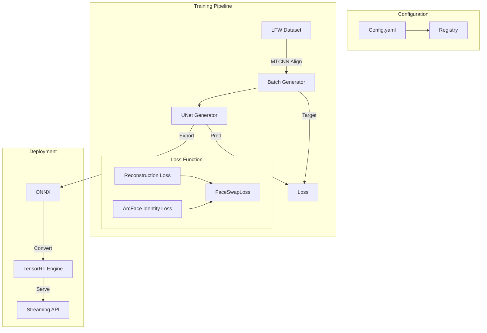

# 🎭 Face Swap System (LFW)

[](https://www.python.org/downloads/)
[](https://yaml.org/)
[](LICENSE)
[](https://github.com/astral-sh/ruff)

A modular, config-driven pipeline for **Face Swapping** on the LFW dataset. Designed for **reproducible research** and **high-performance edge deployment**, featuring native support for ONNX, TensorRT, and real-time streaming.

## 📰 News

- **[2026-01-21]** 🚀 **v0.1.0 Release**: 
    - **Architecture**: `UNetFaceSwap` generator with `FaceSwapLoss` (Identity + Reconstruction).
    - **Edge Ready**: One-click export to **ONNX** and **TensorRT** with `trtexec` integration.
    - **Streaming**: Low-latency inference pipeline for video streams via REST API.
    - **Metrics**: Integrated **ArcFace** identity verification and L1 reconstruction metrics.

## ✨ Features

### 🔧 **Declarative Configuration**
- **YAML-Based**: Define every aspect of your experiment (dataset, model, loss, runner) in a single file.
- **Registry System**: Instantly swap components using string keys (e.g., `registry.models.UNetFaceSwap`).
- **Reproducibility**: Automatic serialization of configs and seeds to `work_dirs/`.

### ⚡ **Edge Optimization & Export**
- **ONNX Export**: Native export pipeline (`scripts/export.sh`) with opset control.
- **TensorRT Acceleration**: Seamless integration with `trtexec` to build optimized engines (`.trt`) for NVIDIA Jetson/Orin.
- **Benchmarking**: Built-in latency and FPS profiling tool (`scripts/benchmark_edge.sh`) for target hardware.

### 📊 **Advanced Evaluation**
- **Identity Preservation**: Uses **ArcFace** embeddings to calculate identity distance between source and swapped faces.
- **Reconstruction Quality**: Monitors L1/L2 pixel loss and structural similarity.
- **Validation Loop**: Automatic validation on held-out splits during training.

### 🔄 **Streaming & Production**
- **Real-Time Pipeline**: Specialized `StreamingPipeline` for processing video frames with minimal overhead.
- **REST API**: FastAPI-based server endpoints for batch processing, stream ingestion, and report generation.
- **Docker Ready**: Designed for containerization with clearly defined CPU/GPU dependency sets.

## 🏗️ Architecture



## 📚 Documentation

Detailed guides are available in the `docs/` directory:

- **[Getting Started](docs/get_started.md)**: Setup, installation, and first experiment.
- **[Configs & Conventions](docs/configs.md)**: Detailed breakdown of `UNetFaceSwap`, `FaceSwapLoss`, and YAML options.
- **[Data & Manifests](docs/data.md)**: LFW ingestion, MTCNN alignment, and manifest schemas.
- **[Export & Edge](docs/export_edge.md)**: Deployment guides for ONNX and TensorRT.
- **[Streaming & REST](docs/streaming.md)**: API reference for `/face-swap/stream` and `/face-swap/batch`.
- **[Troubleshooting](docs/troubleshooting.md)**: Solutions for common dependency and export errors.
- **[FAQ](docs/faq.md)**: Frequently asked questions about the system.

## 🛠️ Installation

> 💡 For a comprehensive setup guide, see **[Getting Started](docs/get_started.md)**.

1. **Clone the repository**
   ```bash
   git clone https://github.com/your-org/face_swap.git
   cd face_swap
   ```

2. **Create a Conda environment**
   ```bash
   conda create -n face_swap python=3.11
   conda activate face_swap
   ```

3. **Install dependencies**
   ```bash
   pip install -r requirements.txt
   ```

## 🚀 Usage

All commands are config-driven. The core configurations are located in `configs/face_swap/`.

### 1. [Data Preparation](docs/data.md)
Download and align the LFW dataset using MTCNN.
```bash
bash scripts/prepare_data.sh
```

### 2. [Training](docs/configs.md)
Train the `UNetFaceSwap` model with `FaceSwapLoss`.
```bash
bash scripts/train.sh
# Configuration: configs/face_swap/baseline.yaml
```

### 3. Evaluation
Evaluate identity preservation and reconstruction quality.
```bash
bash scripts/eval.sh
# Configuration: configs/face_swap/eval.yaml
```

### 4. [Inference & Streaming](docs/streaming.md)
Run inference on specific samples or real-time streams.
```bash
bash scripts/infer.sh
# Configuration: configs/face_swap/infer.yaml
```

### 5. [Export & Benchmark](docs/export_edge.md)
Export to ONNX/TensorRT and benchmark performance.
```bash
# Export to ONNX
bash scripts/export.sh

# Export to TensorRT (requires TensorRT)
bash scripts/trt.sh

# Benchmark Edge Performance
bash scripts/benchmark_edge.sh
```

## 📂 Project Structure

```text
face_swap/
├── configs/
│   └── face_swap/       # Experiment configurations (YAML)
│       ├── baseline.yaml
│       ├── eval.yaml
│       ├── export.yaml
│       └── ...
├── docs/                # Documentation (Markdown)
├── scripts/             # Shell scripts for pipeline stages
│   ├── prepare_data.sh
│   ├── train.sh
│   ├── export.sh
│   └── ...
├── src/
│   ├── data/            # Dataset loading, alignment (MTCNN), and manifests
│   ├── exporters/       # ONNX and TensorRT export logic
│   ├── interfaces/      # CLI, REST API, and Python entry points
│   ├── models/          # UNetFaceSwap, FaceSwapLoss, ArcFaceEmbedder
│   ├── pipelines/       # Training, Evaluation, and Streaming pipelines
│   ├── registry/        # Component registry (Models, Data, Augs)
│   ├── runners/         # Training loop runners
│   └── utils/           # Metrics, logging, and helpers
└── tests/               # Unit, Integration, and Contract tests
```

## 📜 License

This project is licensed under the **MIT License**.

## 🖊️ Citation

If you use this codebase, please cite:

```bibtex
@misc{face_swap_2026,
  author = {Christian Lee},
  title = {Face Swap System: Config-driven LFW Pipeline},
  year = {2026},
  journal = {GitHub repository},
  howpublished = {\url{https://github.com/your-org/face_swap}}
}
```
